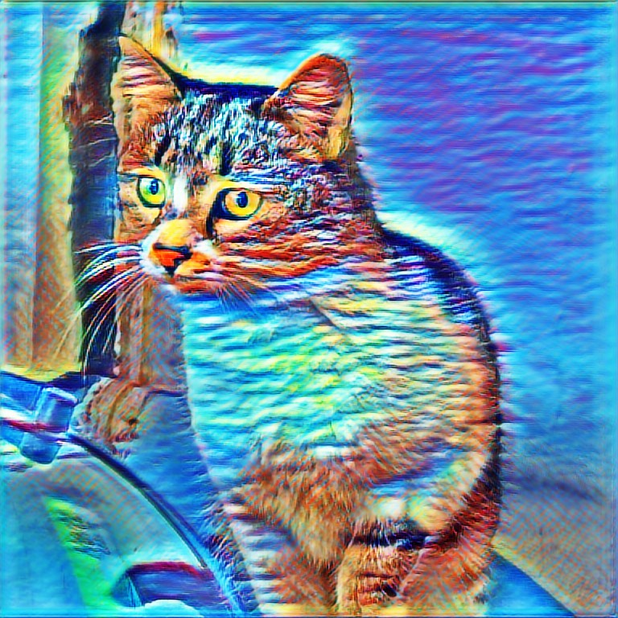
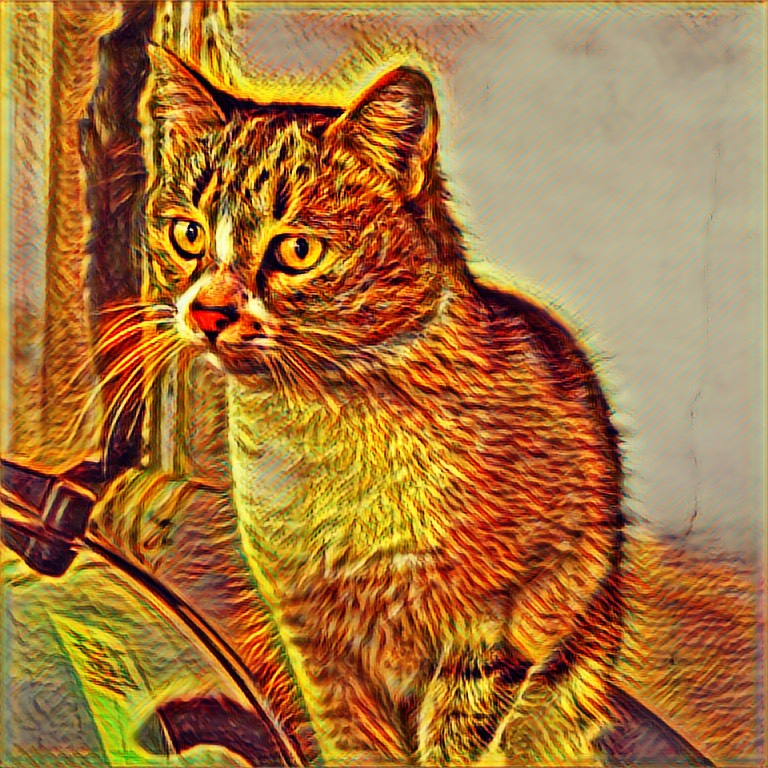
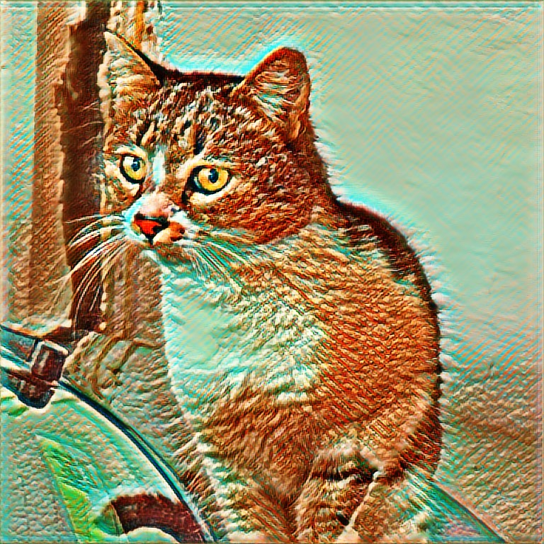
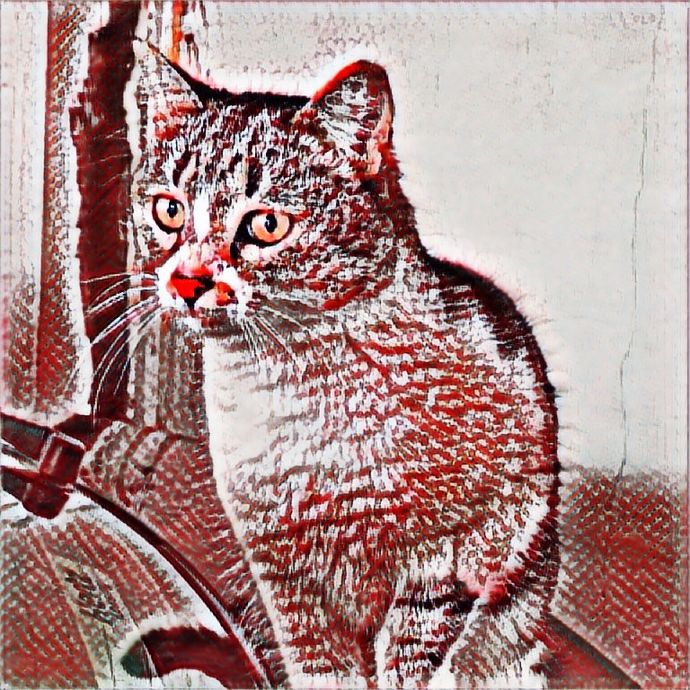
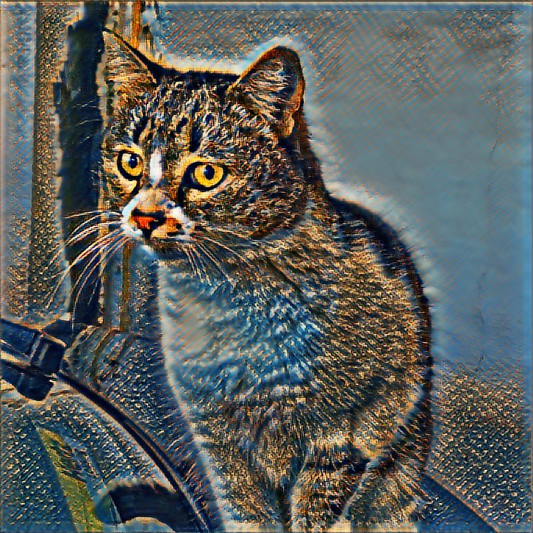
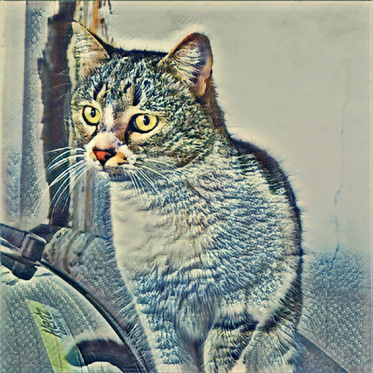
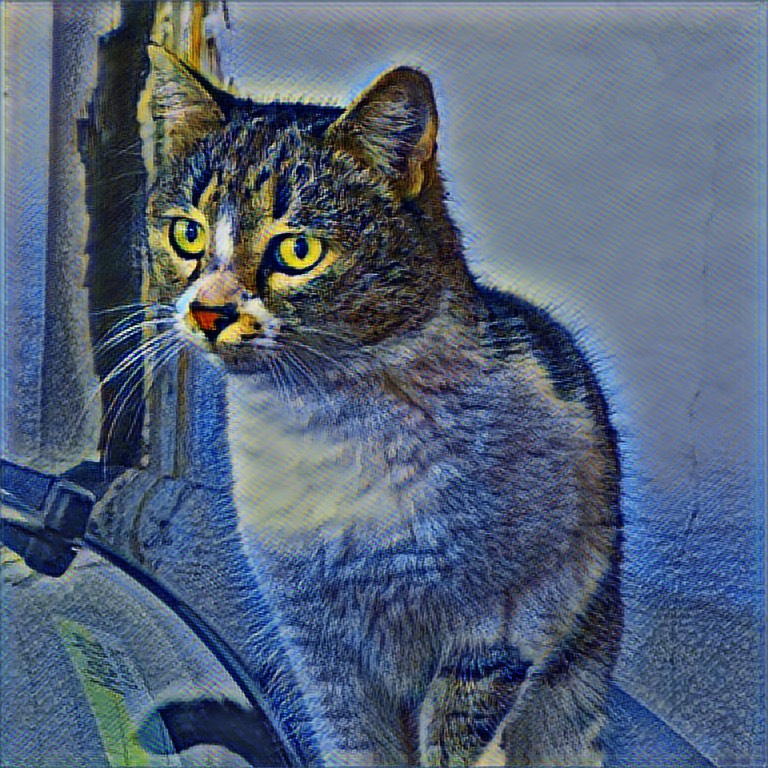

# MLStyleTransferPlayground
##### A macOS Swift Playground for testing your image stylizing CoreML model

* The playground loads and compiles the model in runtime
* It comes with an example model I have prepared
* Before you start, please create a folder named _"Shared Playground Data"_ in your _~/Documents_ folder, it's where the tiff files are written to
* You can run _convertOutput.sh_ to batch convert them into jpg's
* Before you try the example model, set the correct full path for the _inputImageFullPath_ and _mlModelFullPath_ parameters

##### You can see the stylized result inline

###### There are 10 styles in the example model (0 to 9)
  

  

  

